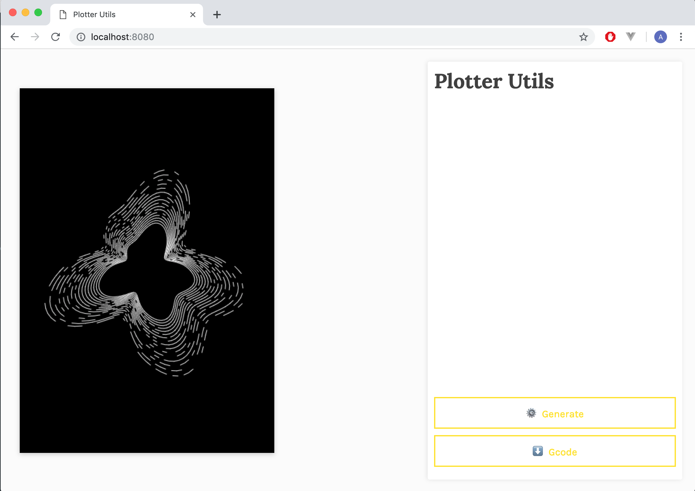

# Plotter utils 🐝 !
⚠️ THIS IS A WORK IN PROGRESS  ⚠️

Welcome to my plotter lib. Here you will find multiples tools to parse svg path, generate gcode and more. 
Every tools is located in the `lib/` folder and you can find a doc for each one right above. 
This is an early work and still a work in project, be carefull using it ! 



I Own an Eleksdraw plotter, at the moment this is the only plotter i have access to. 

## Install 

To install dependencies and run the exemple project 
```shell
npm install 
npm run dev -- --env.project=exemple
```

To create a new project, just create a new folder with a `index.js` at his root.
Then run the commands `npm run dev -- --env.project=FOLDER_NAME`, this will watch your new js file.
I recommand to use a dev server aside to serve index.html, here is a simple way you can do it: `python -m SimpleHTTPServer 8080`

### First Sketch 
Take a look at the exemple project located in `src/exemple/`. This project generate a simple circle

### Canvas.Utils.js
This is a time saving file with simple functions:

#### `createCanvas(canvasSize, viewScale)`
Create a canvas tag after dom loaded

* `canvasSize` : Object, size of the canvas as this:  `{ width: 100, height: 100}`
* `viewScale` : Integer, that only scale the canvas render .

#### `drawPath(ctx, position, viewScale, color)`
Render the path on canvas,
* `canvasSize` : Object, size of the canvas as this:  `{ width: 100, height: 100}`
* `position`: Array of object, contains positions and pen status 
```javascript
var positions = [{
    x: 0, 
    y: 0,
    penState: 'down' // or 'up'
}]
```
* `viewScale` : Integer, that only scale the canvas render .
* `color`: String, default is white.

### Gcode.js

Generate gcodes commands from an array of points. First, you need to configure it ( config above for an eleksdraw plotter );
```json
 {
	"maxSize": {
		"x": 200,
		"y": 287
	},
	"revert": true,
	"unit": "G21", // mm
	"penDownCommand": "S1000 M5",
	"penUpCommand": "S0 M5",
	"baseCommand": "G01"
}
``` 

#### `generate()` :
```javascript
const gcode = new Gcode(config)
var gcodeCommands = gcode.generate(positions) // path is an array of position and pen status
console.log(gcodeCommands) 
```

More stuff comming soon, stayed tuned ! 

